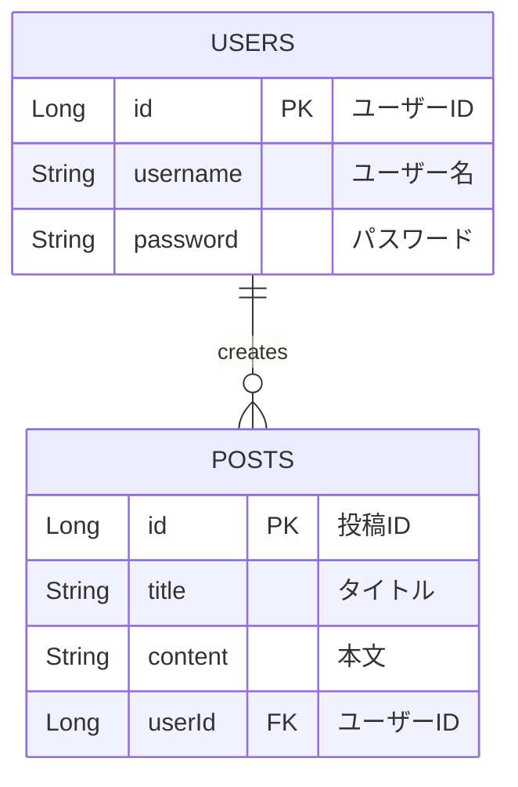

# ヨクバロ (YOKUBARO) 欲張りに生きる人のためのプライベートログ！

## アプリケーションの概要

「ヨクバロ」は、日々の「思い出す前提のメモ」やアイデアなどをハッシュタグ付きで手軽に投稿・管理できる、シンプルで使いやすいWebアプリケーションです。
本文中に `#タグ名` を含めるだけで自動的にタグが抽出され、ワンクリックで呼び出せる便利な機能を備えています。

## アプリケーションの画面イメージ

- 投稿一覧画面
- 投稿詳細・編集画面
- 新規投稿画面（タグチップ機能）

## 開発した背景・こだわり

- **背景**:
  個人ユーザーが自分自身のプライベートな記録用として、だれでも直感的に操作できるシンプルなUIで、日々のアイデアや記録を管理したいという目的から開発しました。

- **こだわり**:
  過去の投稿からハッシュタグを自動収集し、入力フォームでチップとして再利用できる独自のUXを取り入れました。
  記事投稿時・検索時どちらも表記ブレのないタグをすぐにテキストフォームに挿入できます。
  キーワードやタグで素早く情報を引き出し、紙のメモにはない「検索の時短」を実現しています。

## 主な機能一覧

- ユーザー登録機能、ログイン・ログアウト機能
- 投稿のCRUD機能（新規作成、一覧表示、詳細表示、編集、削除機能）
- 検索機能（キーワードやタグによる絞り込み・キーワード検索など）

## 主な使用技術

### Frontend

- React (Vite)
- React Router (ルーティング管理)
- JavaScript (ES6+), HTML, CSS

### Backend

- Java 17 / Spring Boot
- Spring Security (認証・認可)
- Spring Data JPA / Hibernate

### Database

- H2 Database

### Development & Tools

- IntelliJ IDEA, Git, GitHub
- Node.js, npm, Docker

## ER図（データベース設計）

## ローカル環境での起動方法（セットアップ手順）

他の環境からクローンして動作確認を行う際の手順です。

## 💻 動作環境（前提条件）

プロジェクトをローカルで動かすために、事前に以下のインストール・環境準備が必要です。

- **Java Development Kit (JDK)**: Java 17 以上
- **Node.js & npm**: フロントエンドの依存関係インストール・実行用（LTS版推奨）
- **IDE**: IntelliJ IDEA（バックエンド開発・実行用。EclipseやVS Codeでも可）
- **Git**: リポジトリのクローン用

1. リポジトリのクローン
   Bash
   git clone [https://github.com/Nyama-zaki/yokubaro.git](https://github.com/Nyama-zaki/yokubaro.git)
   cd yokubaro

2. バックエンド（Spring Boot）の起動
   IntelliJ IDEAなどのIDEでプロジェクトを開き、YokubaroApplication.java を実行します。
   ポート番号: 8080

   H2コンソール確認URL: http://localhost:8080/h2-console
   JDBC URL: jdbc:h2:mem:yokubarodb;DB_CLOSE_DELAY=-1
   ユーザー名: sa / パスワード: （空欄）

3. フロントエンド（React）の起動
   Bash
   cd frontend (または該当のフロントエンドフォルダ)
   npm install
   npm run dev
   ポート番号: 5173 （ブラウザで http://localhost:5173 にアクセス）

### テスト用アカウント

- **ユーザーID**　test_user_001
- **パスワード**　123456az

## 将来の展望

- 画像アップロード機能の追加
- 外部向け閲覧専用URL発行機能の追加
